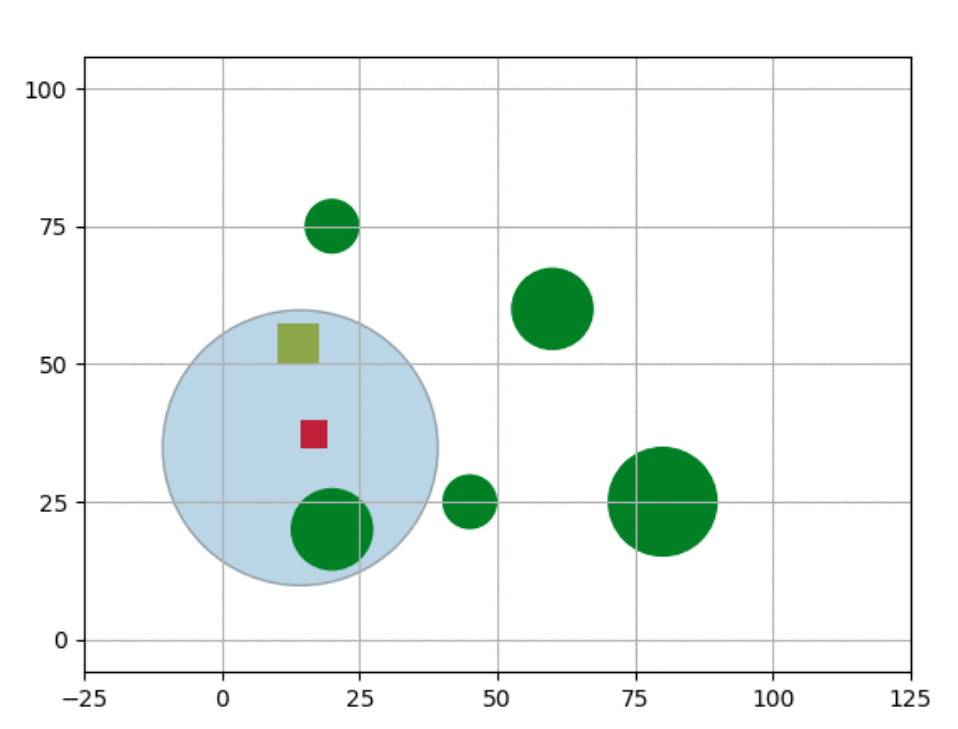

# Target Tracking Simulator

This repository contains code for urban environment simulator that can be used to test Target Tracking algorithms. It has functionalities for dynamic target and cylindrical obstacles.

---

### Contents

- <i>animation_2d</i>: Simulate the environment in x-y plane.
- <i>animation_3d</i>: Simulate the environment in x-z plane.
- <i>create_map</i>: Create customisable map for the environment. 
- <i>args</i>: Arguments that are used by all other scripts.

---

### Testing your Algoriths using this Simulator

- Install all required libraries. For this simply run the following command.
```
pip install -r requirements.txt
```

- Add your target-tracking algorithm code in the same directory. 

That file must read the current state of the target from the file <i>state_car.txt</i>, which could be used to determine the effectiveness of the choosen action by your algotithm. You may use the snippet given below for reading the file.

```
file = open("state_car.txt", "r")
car_state = file.read().split()
car_state = list(map(float, car_state))
```

It also must write the state of the drone obtained by performing the action suggested by your algorithm. You could use the following snippet for that. Here, <i>time_step_drone</i> is the step counter which is incremented whenever an action is taken by the agent.

```
file = open("state_drone.txt", "w")
file.write(str(state_x) + ' ' + str(state_y) + ' ' + str(state_z) + ' ' + str(time_step_drone))
file.close()
```

- Change the position, radius, height and number of obstacles based on your requirements. This can be done by changing line 44-46 in <i>animation_2d.py</i> and line 45-47 in <i>animation_3d.py</i>. 

For example, for setting the position as p_x and p_y, radius as r and height as h for an obstacle, make the following additions to <i>animation_2d.py</i> and <i>animation_3d.py</i> respectively.

```
obstacle_name = patches.Circle((p_x, p_y), radius=r, fc='g')

obstacle_name = patches.Rectangle((p_x, 0), 2*r, h, fc='g') 
```

- Add or change the arguments of your choice in <i>args.py</i> file. You may also want to change the plotting configurations placed immediately after the import statements in all animation files.

- Finally, for simulating an episode using actions suggested by your algorithm, run the following commands in seperate terminals.

```
python animation_2d.py
python animation_3d.py
python your_target_tracking_algorithm_script.py
```

### Screenshot of Environment

Below is a screenshot of the environment developed by the animation_2d.py script. Here, red circles depict the agent, yellow circles depict the target, blue circle depicts the FOV and green ones depict the obstacles.




